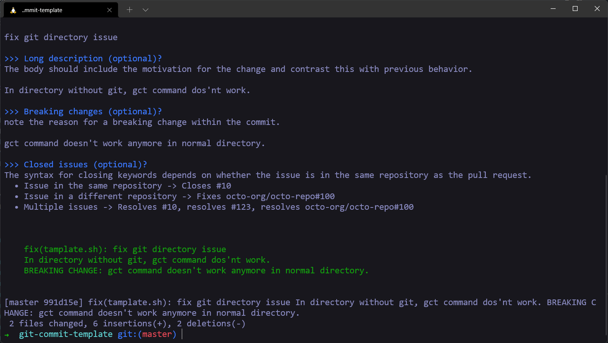

[](https://github.com/ghasemdev/git-commit-template/releases/tag/v1.1.0)
[](https://opensource.org/licenses/MIT)

# git-commit-template

To better write git commit messages, we can use template to specify the 
desired description and type of message. This file is prepared for use in zsh.

## Learn This Articles

- #### [How to Write Better Git Commit Messages](https://www.freecodecamp.org/news/how-to-write-better-git-commit-messages/)

- #### [Epower Git Template](https://github.com/epowerng/git-template)

- #### [چگونه یک پیغام گیت با معنا بنویسیم؟](https://virgool.io/@mmdsharifi/how-to-semantic-git-commit-messages-gvmmqatf6acg)

## Installation

In the first step, in the home directory (zshrc directory) clone git-commit-template.

```bash
➜  ~ git clone https://github.com/ghasemdev/git-commit-template.git
```

Then we have to run this command to install.

```bash
➜  ~ chmod +x git-commit-template/installer.sh
➜  ~ git-commit-template/installer.sh
```

In the last command we refresh oh-my-zsh source.

```bash
➜  ~ source ~/.zshrc
```

## Usage

All you have to do is call the `gct` command and fill in the items that 
are not optional at each step to prepare the message format.




With the `git log` command, we can see the message that we committed.


## Tanks For Supporting 🐯

